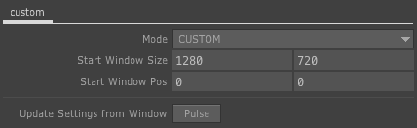

# TouchDesigner Window Start Settings

You can also control the built-in Window Placement Dialog.

ビルトインのウィンドウプレイスメントダイアログで全く同じことができます。

**[ [English](#usage) / [日本語](#使い方) ]**

A Component for Start Windows Settings TouchDesigner Project.
Once set up, you will be able to open the window in the same setting when you open the project next time.

TouchdDesignerのウィンドウの起動設定を行うことのできるコンポーネントです。
一度設定しておくと、次回プロジェクトファイルを開くときに同じ設定でウィンドウを開くことができるようになります。

[ [Download](https://github.com/Joe0hara/TD-Window-Start-Settings/releases/latest/download/WindowStartSetting.tox) ]

## Usage

- Drag and Drop it component (WindowStartSetting.tox) to somewhere
- Edit parameter
- TouchDesigner 2020.23680 or later

## Parameters

- Mode
  - DEFAULT   - Default Mode
  - FULL   - Full screen representation Mode
  - LEFT   - Left justification Mode
  - RIGHT  - Right justification Mode
  - CUSTOM - Custumize Mode

- Start Window Size
  - Edit only in CUSTOM

- Start WindowsPos
  - Edit only in CUSTOM

- Update Settings from Window
  - Clicking this button will then read its current windows settings and apply them to the parameters above.

## 使い方

- WindowStartSetting.tox をプロジェクトの任意の場所に置く
- パラメータを調整
- TouchDesigner 2020.23680 以降のバージョンでのみ使用可能

## パラメーター

- Mode
  - DEFAULT   - デフォルト表示
  - FULL   - 全画面表示
  - LEFT   - 左寄せ表示
  - RIGHT  - 右寄せ表示
  - CUSTOM - カスタマイズ表示

- Start Window Size
  - CUSTOMモード時のみ編集可能

- Start WindowsPos
  - CUSTOMモード時のみ編集可能

- Update Settings from Window
  - ボタンを押すと、現在のウィンドウの値を読み取って、上記の設定に反映
